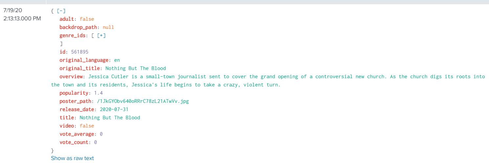
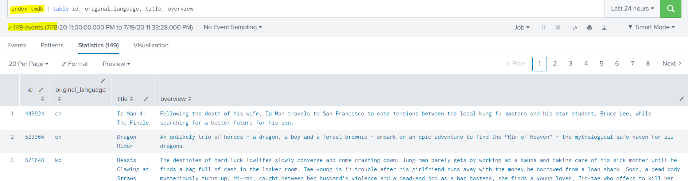

## Consulta da API de filmes e indexação dentro de um index no Splunk

* Basta criar o index e incluir o script dentro do caminho: Settings -> Data Inputs -> Scripts -> Definir o nome e o sourcetype _json

## Consulta:

# **Links Úteis**
* [Documentação da API](https://www.themoviedb.org/)
* [Documentação Oficial](https://docs.splunk.com/Documentation/SplunkCloud/latest/AdvancedDev/ScriptSetup)